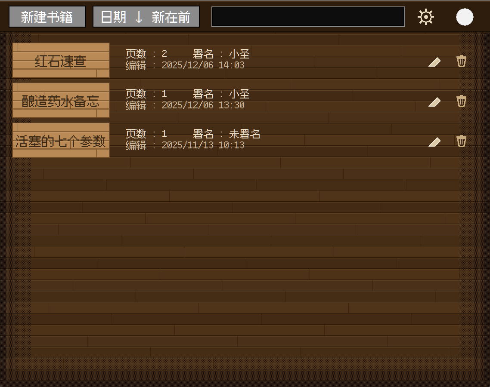

# 书与笔 / MC Notepad

用 Python + tkinter 复刻 Minecraft 里那本「书与笔」的桌面记事本。
**零第三方依赖、单文件、Windows**。界面全部手绘（Canvas），没有用任何 UI 框架。

> 中文名叫「书与笔」，英文与路径统一叫 **MC Notepad**。窗口标题跟着界面语言走。

> **这是一个私有仓库**，仅供自用与个人备份，不是公开发布的项目。

---

## 界面

| 界面 | 说明 |
|---|---|
| **书架** | 顶栏（新建 / 排序 / 搜索 / 设置）+ 木牌书列（书名・页数・署名・最后编辑时间） |
| **书页** | 木质书框里的左右跨页，一次翻一页；页顶页码，左右下角折角翻页 |
| **署名** | 棕皮书皮面板，填书名与署名 |
| **设置** | 中英文切换、页内横线、行距、字号（1×/2×/3×）、墨水颜色，带实时预览 |

四个界面共用同一个 760×600 窗口，切换时不会跳尺寸。



## 功能

- **真翻页动画**：纸有正面/背面，翻过去时宽度按 `cos θ` 收窄并带缓动——不是平移糊弄。
- 页数**无上限**；写满一页自动进下一页，不滚动、不截断。
- **署名不锁内容**：署名只是起名字，之后照样能写能加能删（原版那套"签完就锁死"不好用）。
- **中文像素字体**：用「缝合像素字体」（Fusion Pixel），中文和英文是同一套像素观感，不会一个像素字配一个平滑字。
- 每页 13 行，行距 / 字号 / 墨色可调，横线可开关。
- 按最后编辑时间正序/倒序排列，支持搜索，可导出为 `.txt`。

## 运行

需要 **Python 3.10+**（必须带 `tkinter`）：

```bat
pythonw "MC Notepad.py"
```

或者双击 `启动 MC Notepad.vbs` —— 免控制台，不弹黑窗。

## 打包成 exe

用 PyInstaller（**务必用 onedir，不要用 onefile**，原因见下）：

```bat
python -m venv .buildenv
.buildenv\Scripts\pip install pyinstaller
.buildenv\Scripts\python -m PyInstaller --noconfirm --onedir --windowed ^
  --name "MC Notepad" --icon assets/img/icon.ico ^
  --add-data "assets/fonts/FusionPixel12-zh_hans.ttf;assets/fonts" ^
  --add-data "assets/img/icon.png;assets/img" ^
  --distpath dist --workpath build2 "MC Notepad.py"
```

成品在 `dist\MC Notepad\MC Notepad.exe`。

> 重新打包前，**先把 `dist\MC Notepad` 改名移走**再构建。PyInstaller 会 `rmtree` 掉整个产物目录，
> 而用户数据正好不在那儿（见下），这一步只是避免它无谓地删 1000 个文件。

### 为什么不用 onefile

实测：单文件模式每次启动要解压 13MB（冷启动 6s），**关掉窗口后父进程还会卡 30 秒以上不退出**
（临时目录里的 `_tkinter.pyd` / `_tk_data` / `_tcl_data` 在子进程刚退出时删不掉），
内存从 11MB 涨到 66MB，并在 `%TEMP%` 留下删不掉的 `_MEI*` 目录。
onedir 则冷启动 ~1.2s、关闭 ~0.25s、退出码 0、零残留。

## 数据存在哪

```
%LOCALAPPDATA%\MC Notepad\
    library.json     所有书
    settings.json    语言 / 排序 / 横线 / 行距 / 字号 / 墨色
```

**刻意不放 exe 旁边**：PyInstaller 每次重建会把整个产物目录删掉重建，书放那儿等于每次打包格式化一次书架。
想备份或换机器，直接拷这个文件夹。

调试时可以用环境变量 `MCBUKU_DATA` 把数据指到别处，避免测试脚本动到真数据。

## 素材与许可

| 内容 | 许可 / 归属 |
|---|---|
| 本项目代码 | **MIT**，见 `LICENSE` |
| 字体 `FusionPixel12-zh_hans.ttf` | 「缝合像素字体」，**SIL OFL 1.1**，见 `assets/fonts/FusionPixel-OFL.txt` |
| 图标 `icon.png` / `icon.ico` | 由用户提供的 Minecraft「书与笔」图标图生成（去除纯灰背景，保留红皮书与白羽毛）；Minecraft 相关素材版权归 **Mojang AB**，本项目仅作致敬与学习用途、非商业，如涉侵权请联系删除 |
| 背景壁纸 | **未随仓库分发**（来自 Wallpaper Engine，作者与授权未确认） |

没有背景图时程序会自动退回**程序化木地板背景**，功能完全不受影响。
想要壁纸版：自己放一张 `bg_760x600.png` 和 `bg_1140x900.png` 到 `assets/img/` 即可（尺寸就是窗口逻辑尺寸 × DPI 缩放）。

## 已知限制

- 像素字体必须按 **整数倍** 渲染才不会模糊，所以字号只有 1×/2×/3× 三档。
- 高 DPI 下字号按纸面高度反推，折行按像素宽度算（不按字符数）。
- 目前只做了 Windows（DPI 感知、字体注册、打包都依赖 Win32 API）。
